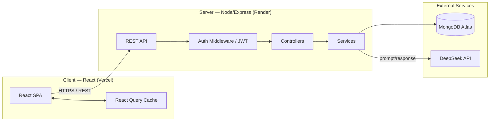
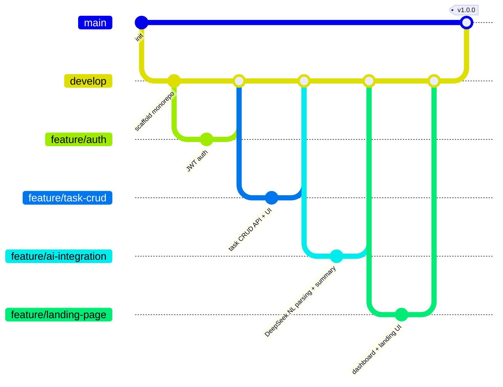
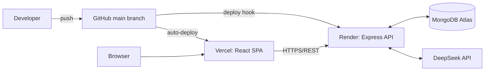

# Smart Task Management System — Architecture Document

**Version:** 1.1
**Stack:** MERN + TypeScript (MongoDB, Express, React, Node.js — TypeScript end-to-end)
**AI Provider:** DeepSeek API (OpenAI-compatible)
**Status:** Approved for implementation

---

## 1. Project Overview

A full-stack task management application with JWT authentication, CRUD task
management, filtering/search, and three AI-powered capabilities built on the
DeepSeek API: natural-language task capture, AI-generated productivity
summaries, and smart task suggestions.

| Decision | Choice |
|---|---|
| Stack | MERN — React (Vite) + Node/Express + MongoDB |
| Language | TypeScript, both `client` and `server` |
| AI Provider | DeepSeek API (`deepseek-v4-flash`) |
| Auth | JWT, email + password |
| Hosting | Vercel (frontend) + Render (backend) + MongoDB Atlas (DB) |
| Repo | Monorepo — `/client` + `/server` |
| Frontend state | TanStack React Query (server state) + Context (UI state: auth, theme) |
| Styling | Tailwind CSS, with dark mode |
| Git workflow | `feature/xxx → develop → main`, PR-gated, CI on every PR |

---

## 2. High-Level Architecture



**Flow summary:** the React SPA never talks to MongoDB or DeepSeek directly —
all external calls are proxied through the Express service layer. This keeps
the DeepSeek API key server-side only (never exposed to the browser) and lets
the backend enforce auth, validation, and rate limits before any paid AI call
is made.

---

## 3. Repository & File Structure

Monorepo, single GitHub repo, two top-level apps plus shared docs/CI.

```
smart-task-manager/
├── .github/
│   └── workflows/
│       ├── ci.yml                 # lint + test, runs on every PR
│       └── deploy.yml             # deploy to Vercel/Render on merge to main
│
├── client/                        # React (Vite) frontend
│   ├── public/
│   ├── src/
│   │   ├── api/                   # axios instance + typed API wrappers
│   │   │   ├── axiosClient.ts
│   │   │   ├── authApi.ts
│   │   │   ├── taskApi.ts
│   │   │   └── aiApi.ts
│   │   ├── components/            # shared, "dumb" UI components
│   │   │   ├── ui/                 (Button, Input, Modal, Badge, Spinner)
│   │   │   └── layout/             (Navbar, Sidebar, DarkModeToggle)
│   │   ├── features/              # feature-based modules (self-contained)
│   │   │   ├── auth/
│   │   │   │   ├── components/    (LoginForm, RegisterForm)
│   │   │   │   ├── hooks/         (useAuth)
│   │   │   │   └── context/       (AuthContext.tsx)
│   │   │   ├── tasks/
│   │   │   │   ├── components/    (TaskList, TaskCard, TaskForm, TaskFilters)
│   │   │   │   ├── hooks/         (useTasks, useTaskMutations — React Query)
│   │   │   │   └── types.ts
│   │   │   ├── ai/
│   │   │   │   ├── components/    (NLTaskInput, AISummaryCard, AISuggestionList)
│   │   │   │   └── hooks/         (useAIParse, useAISummary, useAISuggestions)
│   │   │   └── dashboard/
│   │   │       └── components/    (StatsCards, CompletionChart)
│   │   ├── pages/                 (LoginPage, DashboardPage, TasksPage)
│   │   ├── routes/                (AppRoutes.tsx, ProtectedRoute.tsx)
│   │   ├── context/                (ThemeContext.tsx — dark mode)
│   │   ├── styles/                 (index.css — Tailwind base)
│   │   ├── utils/
│   │   ├── App.tsx
│   │   └── main.tsx
│   ├── .env.example
│   ├── tailwind.config.ts
│   ├── tsconfig.json
│   ├── vite.config.ts
│   └── package.json
│
├── server/                        # Express backend
│   ├── src/
│   │   ├── config/                 (db.ts, env.ts, deepseek.ts)
│   │   ├── models/                 (User.ts, Task.ts — Mongoose schemas + inferred types)
│   │   ├── controllers/            (auth.controller.ts, task.controller.ts, ai.controller.ts)
│   │   ├── routes/                 (auth.routes.ts, task.routes.ts, ai.routes.ts)
│   │   ├── services/               (auth.service.ts, task.service.ts, ai.service.ts)
│   │   ├── middleware/             (auth.middleware.ts, error.middleware.ts, rateLimiter.ts, validate.ts)
│   │   ├── validators/             (auth.schema.ts, task.schema.ts — Zod, doubles as runtime + static types)
│   │   ├── types/                  (express.d.ts — augments Express Request with `user`)
│   │   ├── utils/                  (asyncHandler.ts, ApiResponse.ts, logger.ts)
│   │   ├── app.ts                  # express app, middleware wiring
│   │   └── server.ts               # entry point, DB connect, listen
│   ├── tests/
│   │   ├── unit/                   (services in isolation)
│   │   └── integration/            (supertest against routes)
│   ├── .env.example
│   ├── tsconfig.json
│   └── package.json
│
├── docs/
│   ├── ARCHITECTURE.md             # this file
│   ├── API.md                      # endpoint reference
│   └── screenshots/
│
├── .gitignore
├── .eslintrc.cjs
├── README.md
└── LICENSE
```

**Why this split:** the backend's `services/` layer is where all business
logic and the DeepSeek integration live — controllers stay thin (parse
request → call service → return response), which keeps AI logic testable in
isolation and out of route handlers. The frontend's `features/` folders keep
everything about one concern (e.g. tasks) together instead of spreading
related files across generic `components/`, `hooks/`, `pages/` buckets.

**TypeScript note:** the `Task` shape is defined once (`server/src/models/Task.ts`
via Mongoose, mirrored as a plain type in `client/src/features/tasks/types.ts`).
Keeping both in sync by hand is a known TS monorepo pain point — documented
here as a deliberate tradeoff rather than solved with a shared-package setup,
to keep this project's scope reasonable for the assignment. A natural next
step (noted as a stretch goal, not required) would be a `shared/` workspace
package exporting types both apps import.

---

## 4. Database Design (MongoDB / Mongoose)

### `User`
| Field | Type | Notes |
|---|---|---|
| `_id` | ObjectId | |
| `name` | String | required |
| `email` | String | required, unique, indexed |
| `passwordHash` | String | bcrypt, never returned in API responses |
| `createdAt` / `updatedAt` | Date | timestamps |

### `Task`
| Field | Type | Notes |
|---|---|---|
| `_id` | ObjectId | |
| `userId` | ObjectId (ref `User`) | indexed, scopes all queries |
| `title` | String | required |
| `description` | String | optional |
| `dueDate` | Date | optional |
| `priority` | Enum: `low`, `medium`, `high` | default `medium` |
| `status` | Enum: `pending`, `completed` | default `pending`, indexed |
| `category` | String | e.g. "Work", "Personal" |
| `tags` | [String] | |
| `aiGenerated` | Boolean | true if created via NL parsing |
| `createdAt` / `updatedAt` | Date | timestamps |

Compound index on `{ userId: 1, status: 1, dueDate: 1 }` to serve the
dashboard and filtered-list queries efficiently.

---

## 5. API Design

All routes prefixed `/api`. Protected routes require `Authorization: Bearer <JWT>`.

### Auth
| Method | Endpoint | Description |
|---|---|---|
| POST | `/auth/register` | Create account |
| POST | `/auth/login` | Returns JWT |
| GET | `/auth/me` | Current user (protected) |

### Tasks (all protected, scoped to `req.user.id`)
| Method | Endpoint | Description |
|---|---|---|
| GET | `/tasks` | List, with `?status=&priority=&category=&search=&sort=&page=` |
| POST | `/tasks` | Create task |
| GET | `/tasks/:id` | Get one |
| PUT | `/tasks/:id` | Update task |
| PATCH | `/tasks/:id/status` | Toggle pending/completed |
| DELETE | `/tasks/:id` | Delete task |

### AI (protected, rate-limited)
| Method | Endpoint | Description |
|---|---|---|
| POST | `/ai/parse` | Free text → structured task JSON (title, dueDate, priority, category) |
| GET | `/ai/summary` | AI-generated summary/insights of the user's current tasks |
| GET | `/ai/suggestions` | Suggested next task + reasoning, auto-priority hints |

---

## 6. AI Feature Design (DeepSeek Integration)

All three AI features share one `services/ai.service.js` wrapping the
DeepSeek chat completions endpoint (`https://api.deepseek.com/chat/completions`,
model `deepseek-v4-flash`), called only from the server. (Note: the older
`deepseek-chat` alias was retired by DeepSeek on 2026-07-24 — new
integrations must use the explicit `deepseek-v4-flash` model ID.)

| Feature | Trigger | Prompt strategy | Output |
|---|---|---|---|
| **NL Task Parsing** | User types free text in `NLTaskInput` | System prompt instructs the model to return **strict JSON only** matching the `Task` schema (title, dueDate ISO string, priority, category) | Parsed into a pre-filled `TaskForm` for user confirmation before saving |
| **AI Summary** | User opens dashboard / clicks "Refresh insights" | Model receives a compact JSON list of the user's open tasks (title, due date, priority) and returns a short natural-language summary + risk flags (overdue, overloaded day) | Rendered in `AISummaryCard` |
| **Smart Suggestions** | Dashboard load | Model ranks open tasks by urgency/priority/due date and returns top 3 with one-line reasoning each | Rendered in `AISuggestionList` |

**Cost note:** `deepseek-v4-flash` (public beta as of July 2026) prices at
$0.14/$0.28 per million input/output tokens — a typical parse call costs a
fraction of a cent, so cost is not a real constraint at this scale. The
practices below are kept anyway because they're standard production
hygiene, not budget management:
- `max_tokens` capped per call (150–300) and JSON-only responses for
  parsing — keeps latency low and output easy to validate, not just cheap.
- **Summary and suggestions are cached** server-side per user for 15
  minutes (or until tasks change) instead of calling the API on every
  dashboard load — this is mainly a UX/latency win (instant repeat loads)
  and secondarily reduces load on the AI service.
- A `rateLimiter` middleware still caps AI routes per user — this protects
  against abuse/runaway loops (e.g. a buggy retry storm) regardless of who's
  paying for the key.
- If the DeepSeek call fails, the API degrades gracefully: NL parsing falls
  back to a manual form, summary/suggestions show "unavailable" rather than
  crashing the app — good error handling matters independent of cost.

---

## 7. Authentication & Security

- **Password storage:** bcrypt (12 rounds), never store or log plaintext.
- **JWT:** short-lived access token (e.g. 1h) signed server-side; sent via
  `Authorization: Bearer`. Stored client-side in memory + `httpOnly`
  refresh cookie if refresh flow is added later (documented as a stretch
  goal, not MVP).
- **Middleware chain per protected request:** `helmet` → `cors` (allow-list
  the deployed frontend origin) → `express-rate-limit` (global + stricter
  on `/auth` and `/ai`) → JWT verification → controller.
- **Validation:** all request bodies validated (Zod/Joi) before hitting a
  controller; invalid input never reaches the service layer.
- **Secrets:** `DEEPSEEK_API_KEY`, `JWT_SECRET`, `MONGO_URI` live only in
  environment variables (`.env`, never committed) — set as encrypted
  secrets in Render/Vercel dashboards and as GitHub Actions secrets for CI.
- **Data isolation:** every task query is scoped by `userId` from the
  verified JWT — no task is ever fetched/updated/deleted without an
  ownership check.

---

## 8. Frontend Architecture

- **Server state** (tasks, AI results, user profile): TanStack React Query
  — handles caching, loading/error states, and automatic refetch after
  mutations (e.g. task list refetches after create/edit/delete).
- **UI state** (auth session, theme): React Context, kept intentionally
  separate from server state so Context doesn't balloon into a data store.
- **Styling:** Tailwind CSS with a `dark:` variant strategy; theme
  preference persisted and toggle available in the navbar.
- **Routing:** `react-router`, with `ProtectedRoute` wrapping all
  authenticated pages and redirecting to `/login` on missing/expired JWT.

---

## 9. Git Workflow

Matches the convention specified: **`feature/xxx → develop → main`**, PR-gated, CI on every PR.



**Branch rules:**
| Branch | Purpose | Protection |
|---|---|---|
| `main` | Production, always deployable | Protected, only merges from `develop` via PR, triggers deploy |
| `develop` | Integration branch | Protected, only merges from `feature/*` via PR, CI must pass |
| `feature/xxx` | One feature per branch, e.g. `feature/auth`, `feature/task-crud`, `feature/ai-integration`, `feature/landing-page`, `feature/dark-mode` | Deleted after merge |

**Conventions:**
- Commit messages follow **Conventional Commits**: `feat:`, `fix:`, `chore:`, `docs:`, `test:` (e.g. `feat(tasks): add priority filter`).
- Every PR uses a template covering: what changed, screenshots (for UI), how it was tested.
- No direct pushes to `develop` or `main` — enforced via branch protection rules.

---

## 10. CI/CD Pipeline

**`.github/workflows/ci.yml`** — runs on every PR into `develop` or `main`:
```yaml
name: CI
on:
  pull_request:
    branches: [develop, main]
jobs:
  lint-and-test:
    runs-on: ubuntu-latest
    strategy:
      matrix:
        workspace: [client, server]
    steps:
      - uses: actions/checkout@v4
      - uses: actions/setup-node@v4
        with:
          node-version: 20
      - run: npm ci
        working-directory: ${{ matrix.workspace }}
      - run: npm run typecheck   # tsc --noEmit
        working-directory: ${{ matrix.workspace }}
      - run: npm run lint
        working-directory: ${{ matrix.workspace }}
      - run: npm test -- --ci
        working-directory: ${{ matrix.workspace }}
```

**`.github/workflows/deploy.yml`** — runs on push to `main`:
- Backend: triggers a Render deploy hook (`RENDER_DEPLOY_HOOK_URL` secret).
- Frontend: Vercel auto-deploys on push to `main` via its GitHub integration
  (no extra workflow step needed beyond connecting the repo).

A PR cannot merge unless `lint-and-test` passes for both workspaces —
this is the "CI-gated" part of the workflow.

---

## 11. Deployment Architecture



| Component | Platform | Notes |
|---|---|---|
| Frontend | Vercel | Free tier, auto-deploy on `main`, env vars set in Vercel dashboard |
| Backend | Render | Free/starter web service, env vars set in Render dashboard |
| Database | MongoDB Atlas | Free M0 cluster, IP allow-list includes Render's egress |
| AI | DeepSeek API | Key stored server-side only |

---

## 12. Testing Strategy

- **Backend:** Jest (`ts-jest`) + Supertest — unit tests for `services/`
  (mocking DeepSeek and Mongoose calls), integration tests hitting routes
  against an in-memory MongoDB (`mongodb-memory-server`).
- **Frontend:** React Testing Library for key components (`TaskForm`,
  `TaskList`, `ProtectedRoute`) and hooks, run via Vitest.
- `tsc --noEmit` runs in CI as its own step (Section 10) ahead of lint/test
  — a type error fails the build before tests even run.
- CI runs both suites on every PR; merge blocked on failure.

---

## 13. Implementation Roadmap (maps to feature branches)

| Phase | Branch | Deliverable |
|---|---|---|
| 1 | `feature/auth` | Register/login, JWT middleware, protected routes |
| 2 | `feature/task-crud` | Task model, full CRUD API, task list/form UI |
| 3 | `feature/search-filter` | Search + filter by status/priority/category |
| 4 | `feature/ai-integration` | DeepSeek NL parsing, summary, suggestions |
| 5 | `feature/dashboard` | Stats cards, completion chart |
| 6 | `feature/landing-page` | Landing/login page polish, dark mode |
| 7 | `develop → main` | Final QA, deploy, demo recording |

---

## 14. Assignment Requirements Mapping

| Requirement | Where it's addressed |
|---|---|
| Add/View/Edit/Delete tasks | Section 5 — Task CRUD endpoints |
| Mark Completed/Pending | `PATCH /tasks/:id/status` |
| Search/filter | `GET /tasks` query params |
| Persistent storage | MongoDB Atlas (Section 4) |
| AI feature | Section 6 — NL parsing + summary + suggestions |
| Auth | Section 7 |
| Due dates, priority, categories | `Task` schema (Section 4) |
| Dashboard stats | `features/dashboard` |
| Dark mode | `ThemeContext` + Tailwind `dark:` |
| Responsive UI | Tailwind responsive utilities throughout |
| Deployment | Section 11 |
