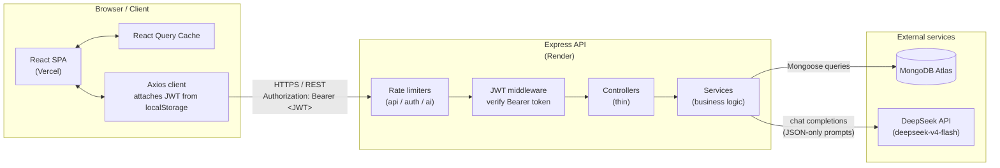

# Smart Task Management System — Architecture

A full-stack MERN application (TypeScript end-to-end) that lets users manage tasks with CRUD, search/filtering, dashboard analytics, and AI-assisted productivity features. It is built for individual users who want to capture tasks quickly and get AI-generated structure out of them — natural-language task parsing, productivity summaries, and ranked "what to do next" suggestions. The core value proposition is AI-assisted task management: the system turns free-text input into structured, prioritized tasks without removing human control over what actually gets saved.

This document describes the system as implemented, based on the actual code in `client/` and `server/`.

---

## 1. Tech Stack

| Layer | Technology | Why chosen |
|---|---|---|
| Frontend framework | React 18 (`react` + `react-dom`) | Mature component model; ecosystem support; fits the SPA requirement |
| Build tool | Vite 5 | Fast dev server and optimized production builds; first-class TypeScript support |
| Language | TypeScript 5.6 (both apps) | End-to-end type safety; shared shapes between API layer and features |
| Styling | Tailwind CSS 3.4 | Utility-first styling with dark-mode support; no component-library lock-in |
| Server state | TanStack React Query 5 | Automatic caching, deduplication, and invalidation of server data; eliminates hand-written loading/error plumbing |
| HTTP client | Axios 1.7 | Request/response interceptors centralize JWT attachment and 401 handling |
| Routing | React Router 6 (`react-router-dom`) | Declarative routing with a `ProtectedRoute` wrapper for auth-gated pages |
| Backend framework | Express 4 (`express`) | Minimal, widely understood; the app's needs (REST + middleware) are simple enough that a heavier framework adds no value |
| Backend language | TypeScript (via `ts-node-dev`, compiled with `tsc`) | Same type system as the client; `tsc --noEmit` runs as a CI gate |
| Database / ODM | MongoDB Atlas + Mongoose 8 | Schema definition and validation in one place; the `Task`/`User` models double as the source of truth for document shapes |
| Input validation | Zod 3 | Runtime validation at the API boundary; schemas in `validators/` also export inferred types used by controllers and services |
| Auth | JWT (`jsonwebtoken`) + bcrypt (`bcryptjs`) | Stateless auth suits a decoupled SPA/API deployment; bcrypt hashes passwords at 10 rounds |
| AI | DeepSeek API (`deepseek-v4-flash`) | Cost-effective chat-completions endpoint called server-side only, so the API key never reaches the browser |
| Testing | Jest 29 + Supertest 7 + `mongodb-memory-server` | Integration tests exercise real routes against an in-memory MongoDB; the DeepSeek module is mocked, and a `fetch` spy asserts no real network calls |
| Deployment | Vercel (frontend) + Render (backend) | Free tiers for both; Vercel auto-deploys from `main`, Render hosts the API with env vars |
| Other hardening | `helmet`, `cors` (allow-list), `express-rate-limit` | Security headers, origin allow-list, and per-route rate limits (see §5) |

---

## 2. System Architecture Diagram



**Auth flow (high level):** on login/register the server returns a JWT (1h expiry) alongside the user. The client stores it in `localStorage` under the key `token` (`features/auth/context/AuthContext.tsx`). An Axios request interceptor (`api/axiosClient.ts`) attaches it as `Authorization: Bearer <token>` on every request. Server-side, `middleware/auth.middleware.ts` verifies the token with `jsonwebtoken`, attaches `req.user = { id }`, and rejects with 401 if missing, malformed, or expired. A client response interceptor clears the stored token and redirects to `/login` on any 401.

---

## 3. Project Structure

```
smart_task_manager/
├── client/                          # React SPA (Vite)
│   └── src/
│       ├── api/                     # Axios instance + typed API wrappers (axiosClient, authApi, taskApi, aiApi)
│       ├── components/
│       │   ├── layout/              # App shell: Layout, Navbar, Sidebar, DarkModeToggle, SidebarContext
│       │   └── ui/                  # Shared "dumb" primitives: Button, Input, Modal, Badge, Spinner
│       ├── context/                 # ThemeContext — dark-mode UI state (server state lives in React Query)
│       ├── features/                # Feature-based modules; each owns its components, hooks, and context
│       │   ├── auth/                # AuthContext, Login/Register forms, useAuth
│       │   ├── tasks/               # Task CRUD UI: TaskList, TaskCard, TaskForm, TaskFilters, types, useTasks, useTaskMutations
│       │   ├── ai/                  # AI UI: NLTaskInput, AISummaryCard, AISuggestionList, useAIParse/useAISummary/useAISuggestions
│       │   └── dashboard/           # StatsCards, Calendar, CategoryBreakdown, UpcomingDeadlines, RecentActivity, TrendIndicator, QuickAdd, DueSoonBanner, useTaskStats
│       ├── hooks/                   # Cross-cutting hooks (useDarkMode)
│       ├── pages/                   # Route-level pages: LoginPage, DashboardPage, TasksPage, CalendarPage
│       ├── routes/                  # AppRoutes (route table) + ProtectedRoute (auth gate)
│       ├── styles/                  # index.css — Tailwind base
│       ├── App.tsx                  # Provider tree: QueryClient → Theme → Auth → Routes
│       └── main.tsx                 # Entry point
│
└── server/                          # Express API
    ├── src/
    │   ├── app.ts                   # Express app: helmet, CORS allow-list, JSON parsing, route mounting, error handlers
    │   ├── server.ts                # Entry point: connectDB() then app.listen()
    │   ├── config/                  # env.ts (env parsing), db.ts (Mongoose connect), deepseek.ts (DeepSeek client)
    │   ├── controllers/             # Thin request/response handlers: auth, task, ai controllers
    │   ├── middleware/              # auth.middleware (JWT verify), validate (Zod), rateLimiter, error.middleware (notFound + errorHandler)
    │   ├── models/                  # Mongoose models: User, Task (+ inferred interfaces)
    │   ├── routes/                  # Route tables: auth.routes, task.routes, ai.routes
    │   ├── services/                # Business logic: auth.service, task.service, ai.service (DeepSeek integration)
    │   ├── types/                   # express.d.ts — augments Express Request with `user`
    │   ├── utils/                   # asyncHandler, ApiResponse, AppError, logger
    │   └── validators/              # Zod schemas: auth.schema, task.schema (doubles as static types)
    └── tests/
        └── integration/             # Supertest suites: auth.test, task.test, ai.test + setup.ts (in-memory Mongo)
```

---

## 4. Key Architectural Decisions

### Feature folders over type-based folders (client)
All code for one concern lives in one folder: `features/tasks/` holds the task UI components, its React Query hooks, and its types; `features/ai/` and `features/auth/` do the same. Only genuinely shared UI (`components/ui/`, `components/layout/`) and app plumbing (`api/`, `routes/`, `context/`) live outside features. This keeps related changes in one place (adding a task field touches one feature) and prevents the `components/`/`hooks/` buckets from growing into unmanageable grab-bags as features are added.

### React Query for server state
Task lists, stats, and AI results are all server state; React Query owns fetching, caching, loading/error presentation, and re-fetching. Mutations declare their invalidation explicitly — `useCreateTask` invalidates `["tasks"]` and `["tasks", "stats"]` on success, so the list and dashboard refresh without hand-written refetch calls. React Context is deliberately limited to auth session and theme (UI state), keeping it out of the data-fetching path.

### JWT over session-based auth
The client and API are deployed on separate origins (Vercel and Render), so cookie-session auth would require cross-origin cookie configuration and CSRF defenses. A stateless JWT (signed with a server secret, 1h expiry) stored in `localStorage` and sent via `Authorization: Bearer` works cleanly across origins, requires no server-side session store, and is invalidated client-side on 401. The tradeoff (token revocation is not immediate) is acceptable for a personal task manager with a short token lifetime.

### Service layer on the backend
Controllers are pure plumbing: extract `userId` from `req.user`, pass validated input to a service, wrap the result in the `ApiResponse` envelope (`utils/ApiResponse.ts`). All business logic lives in `services/`: task queries and stats aggregation, auth/password handling, and the entire DeepSeek integration. This makes the AI logic directly testable (the integration tests mock `callDeepSeek` at the module boundary), keeps route handlers free of logic, and centralizes where a future change would touch.

### AI features: parse-then-confirm, never blind auto-apply
The AI integration follows a strict "suggest, don't decide" pattern:
- **`POST /api/ai/parse`** turns free text into a structured draft (`title`, `dueDate`, `priority`, `category`). The response is loaded into a review modal (`NLTaskInput.tsx` → "Review your AI-parsed task") — nothing is saved yet. Only when the user confirms does the client `POST /api/tasks`, flagging the task with `aiGenerated: true`.
- The server enforces the same caution at write time: `task.service.createTask` re-validates the AI-derived priority and falls back to server-side inference if the parse result is missing/invalid. Manual creates also receive server-inferred priority and tags, so the AI never controls the write path — it only informs it.
- All DeepSeek calls are made server-side through one wrapper (`config/deepseek.ts`), so the API key never ships to the browser, and every AI response is validated before it reaches the client (malformed output surfaces as a clean 502, not a crash).
- The two read-only AI features (summary, suggestions) are cached in-memory per user for 15 minutes to keep dashboard loads fast and avoid redundant paid calls.

---

## 5. Data Flow Example: "Add with AI"

A concrete walkthrough of creating a task from natural language, using the real route names:

1. The user types `"Submit report Friday at noon, high priority"` into `NLTaskInput` (`features/ai/components/NLTaskInput.tsx`) and submits.
2. The `useAIParse` mutation (React Query) calls `aiApi.parseTask`, which POSTs to **`POST /api/ai/parse`** with `{ text }` and the JWT attached by the Axios interceptor.
3. The server chain runs: `apiLimiter` (200 req / 15 min) → `authenticate` (JWT verify) → `aiLimiter` (30 req / 15 min) → `aiController.parseTask`.
4. `aiService.parseTaskFromText` builds a system prompt (including today's date as the reference point for relative dates like "Friday") and calls `callDeepSeek`, which POSTs to `https://api.deepseek.com/chat/completions` (model `deepseek-v4-flash`, JSON response mode, 15s timeout).
5. The service validates the returned JSON (title non-empty, priority in `low|medium|high`, `dueDate` a parseable ISO string) and returns the structured draft.
6. The controller responds `{ success: true, data: { title, dueDate, priority, category } }`. **Nothing is written to the database.**
7. The client opens a modal titled "Review your AI-parsed task" with the fields pre-filled in `TaskForm`; the user can edit them, then confirms.
8. Confirmation triggers `useCreateTask` → `taskApi.createTask` → **`POST /api/tasks`** with `aiGenerated: true`.
9. The server validates the body with Zod (`createTaskSchema`), then `taskService.createTask` re-checks the AI-provided priority (only trusted when `aiGenerated: true`), infers tags server-side via `inferTags`, and writes the document with `TaskModel.create` — always scoped to `req.user.id`.
10. `useCreateTask`'s `onSuccess` invalidates the `["tasks"]` and `["tasks", "stats"]` query keys; React Query refetches both, and the task list plus dashboard stats update immediately.

---

## 6. Testing Strategy

Backend integration tests run with Jest (`ts-jest`) + Supertest against a real Express app instance connected to an in-memory MongoDB (`mongodb-memory-server`, see `tests/integration/setup.ts`). Tests never touch the real database, and the DeepSeek module is mocked at the module boundary (`jest.mock("../../src/config/deepseek")`) with an additional `fetch` spy asserting that no real network calls are made during the suite.

**Current state: 79 tests passing across 3 suites** (`npm test` in `server/`):

| Suite | Coverage |
|---|---|
| `auth.test.ts` | Registration (duplicate email → 409, invalid payload → 400), login (generic 401 for wrong password and unknown email), `/me` with valid/missing/garbage tokens |
| `task.test.ts` | Create with all AI-priority edge cases (AI-provided, missing, invalid, inference fallback, failure fallback, tag inference), list with filters/search/date-range AND semantics, pagination, ownership isolation (404, never 403, for another user's tasks), single-task GET/PUT/PATCH/DELETE, stats endpoint, auth guard |
| `ai.test.ts` | Parse/summary/suggestions from mocked DeepSeek responses, 15-min cache behavior, graceful 502 on malformed/AI failure (never 500), 401 guard on all AI routes, `inferTags` edge cases |

The client has no test runner configured at present; its correctness is guarded by `tsc --noEmit` and ESLint, both wired into the package scripts and CI.

---

## 7. Deployment Architecture

The app is deployed in three parts:

- **Frontend — Vercel.** The React SPA is auto-deployed from `main`. The `VITE_API_URL` environment variable points at the Render backend's base URL (the Axios client falls back to `http://localhost:5000/api` in development).
- **Backend — Render.** The Express API runs as a web service. `CORS_ORIGIN` is set to the Vercel deployment domain; `app.ts` rejects requests from any origin not on that allow-list. `MONGO_URI`, `JWT_SECRET`, and `DEEPSEEK_API_KEY` are set in the Render dashboard and are never committed. A `GET /health` endpoint is available for uptime checks.
- **Database — MongoDB Atlas.** The M0 free cluster's network access allow-list is configured to accept connections from Render's egress IPs. `config/env.ts` requires `MONGO_URI` in production and fails fast if it is missing.

**Free-tier caveat:** Render's free web service spins down after inactivity, so the first request after an idle period incurs a cold start of roughly 30–60 seconds (the browser shows a loading state while the API boots and reconnects to MongoDB). Subsequent requests are fast until the next idle period.