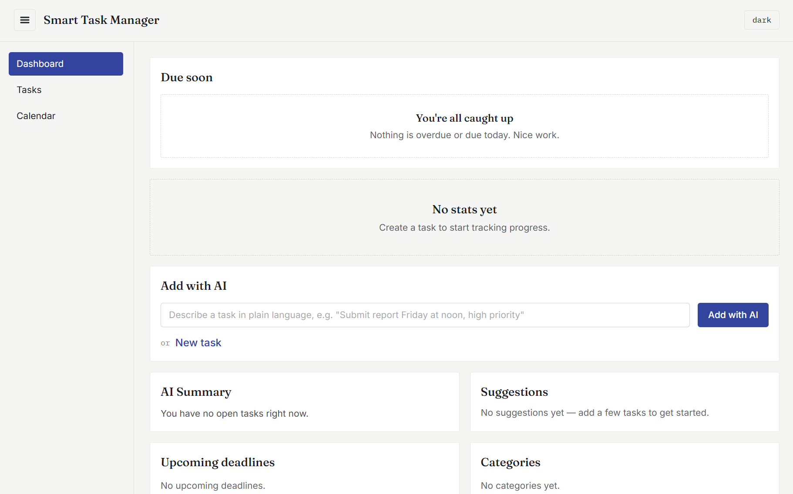
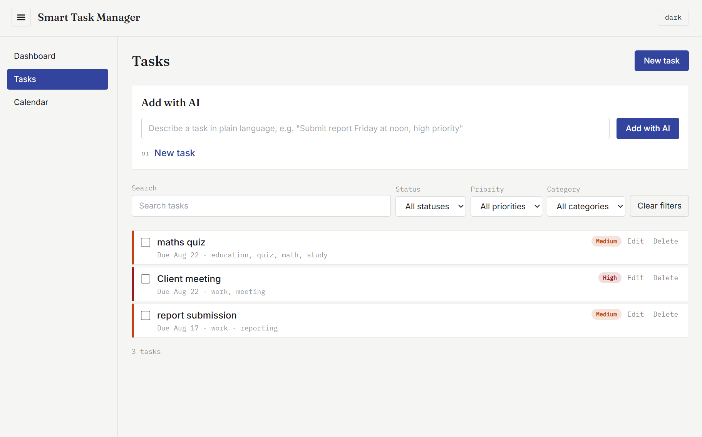
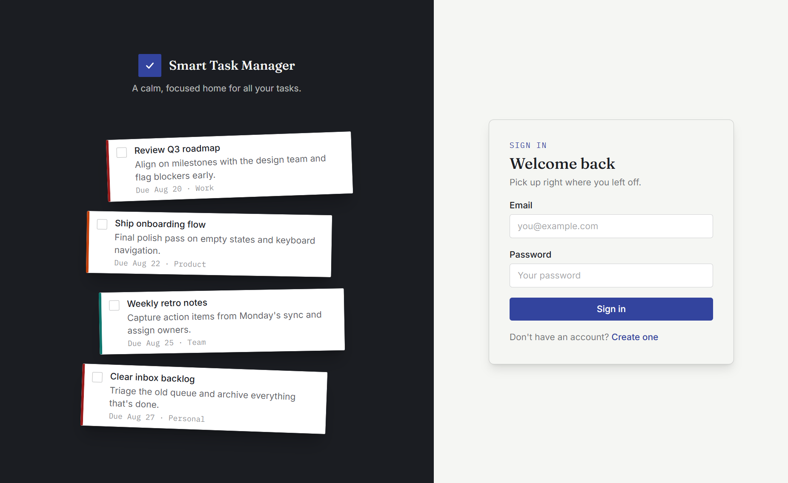
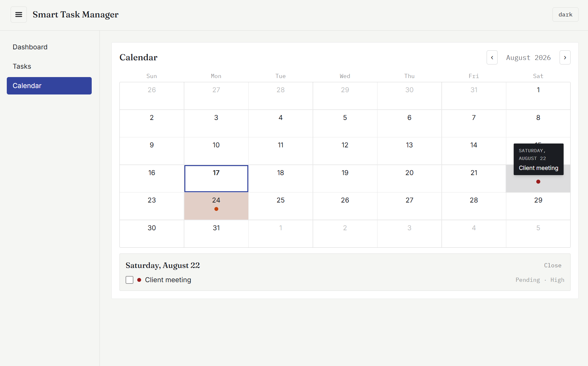
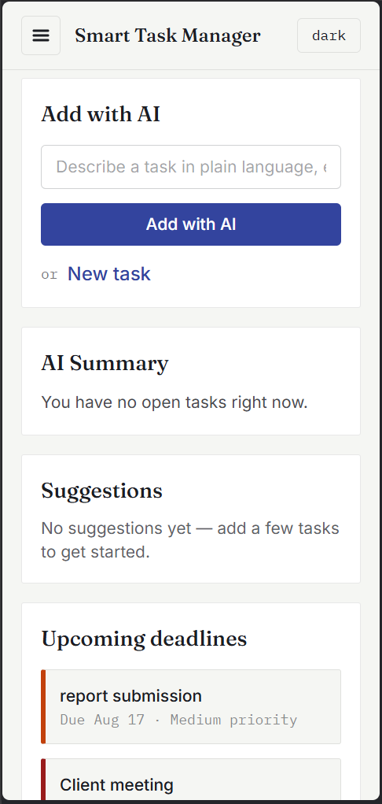
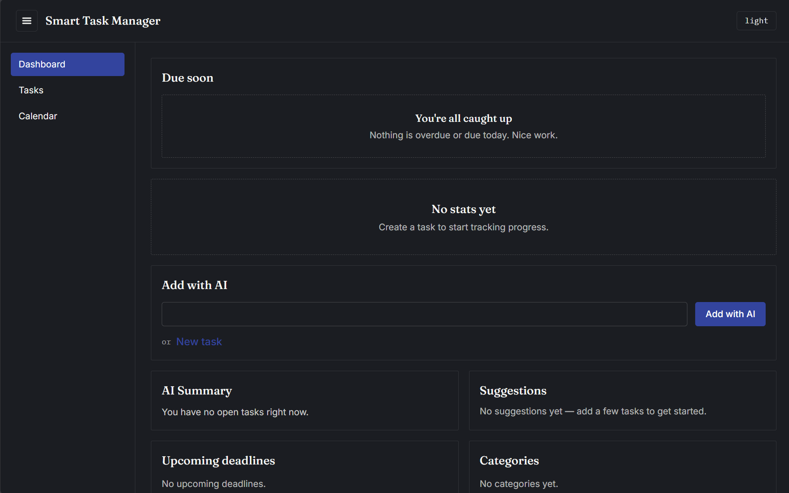

# Smart Task Management System

A full-stack task manager (MERN + TypeScript) with AI-assisted features: capture tasks in plain language, and let the app parse, prioritize, and organize them for you.

## Live Demo

**https://smart-task-management-system-zeta.vercel.app/**

> The backend runs on Render's free tier, so the first request after a period of inactivity may take 30–60 seconds to wake up.

## Features

- **Task management** — create, view, edit, and delete tasks with titles, descriptions, due dates, priority (low/medium/high), categories, and AI-inferred tags
- **Complete / pending** — toggle task status with one click
- **Search & filter** — filter by status, priority, and category, plus case-insensitive text search across title and description, with sorting and pagination
- **Dashboard** — stats (total, completed, pending, overdue, completion rate), priority/category breakdowns, upcoming deadlines, recent activity, weekly trend, and a "Due Soon" reminder banner
- **Calendar view** — see tasks on their due dates
- **Dark mode** — theme toggle persisted across sessions
- **Responsive layout** — mobile-friendly with a collapsible sidebar
- **Authentication** — email/password registration and login with JWT (bcrypt-hashed passwords, protected routes)
- **AI features (DeepSeek)**
  - **Natural-language parsing** — type "Submit report Friday at noon, high priority" and get a structured, editable task draft to confirm before saving
  - **AI summary** — an at-a-glance summary of your open tasks with risk flags (overdue, overloaded days)
  - **Smart suggestions** — top-3 ranked "what to work on next" with one-line reasoning

## Tech Stack

- **Frontend:** React + Vite + TypeScript, Tailwind CSS, TanStack React Query
- **Backend:** Express + TypeScript, Mongoose
- **Database:** MongoDB Atlas
- **AI:** DeepSeek API
- **Auth:** JWT + bcrypt

See [ARCHITECTURE.md](ARCHITECTURE.md) for the full stack breakdown, system diagram, and architecture decisions.

## Screenshots


*Dashboard — stats, due-soon reminders, and AI insights*


*Task list with search, filters, and Add-with-AI*


*Sign in / sign up*


*Calendar view*


*Responsive mobile layout*


*Dark mode*

## Getting Started (Local Setup)

**Prerequisites:** Node.js 20+, npm, and a running MongoDB instance (local install or MongoDB Atlas cluster).

1. **Clone the repository**

   ```bash
   git clone <repo-url>
   cd smart_task_manager
   ```

2. **Install dependencies** — in both workspaces:

   ```bash
   cd server && npm install
   cd ../client && npm install
   ```

3. **Configure environment variables**

   Server — copy `server/.env.example` to `server/.env` and fill in:

   | Variable | Purpose |
   |---|---|
   | `NODE_ENV` | `development` or `production` |
   | `PORT` | API port (default `5000`) |
   | `MONGO_URI` | MongoDB connection string (local `mongodb://127.0.0.1:27017/smart_task_manager` or your Atlas URI) |
   | `JWT_SECRET` | Secret used to sign auth tokens — use a long random string |
   | `DEEPSEEK_API_KEY` | Your DeepSeek API key (required for AI features; the app still works without it, AI calls will return errors) |
   | `CORS_ORIGIN` | Comma-separated list of allowed browser origins (default `http://localhost:5173`) |

   Client — copy `client/.env.example` to `client/.env`:

   | Variable | Purpose |
   |---|---|
   | `VITE_API_URL` | Base URL of the API (default `http://localhost:5000/api`) |

4. **Start the backend**

   ```bash
   cd server
   npm run dev
   ```

   Runs on `http://localhost:5000` (health check: `GET http://localhost:5000/health`).

5. **Start the frontend**

   ```bash
   cd client
   npm run dev
   ```

6. **Open the app** at `http://localhost:5173`, register an account, and start adding tasks.

## Running Tests

The backend has an integration test suite run with Jest + Supertest against an in-memory MongoDB (`mongodb-memory-server`) — no real database is touched:

```bash
cd server
npm test
```

Current status: **79 tests passing** across 3 suites (auth, tasks, AI).

## Project Structure

This is a monorepo with two workspaces: `client/` (React SPA) and `server/` (Express API), each with feature-based folders. See [ARCHITECTURE.md](ARCHITECTURE.md) for the annotated project structure, system diagram, data flows, and deployment setup.